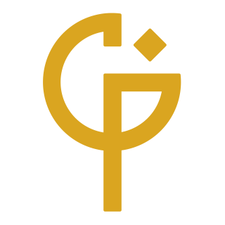

**PHI - ALX WEBSTACK PROJECT - BACKEND SOFTWARE ENGINEER SPECIALIZATION END**
==============================================================================

Phi is a web application designed for professionals of all backgrounds and disciplines to share their passion for work, promote their sector of activity and find new career or even a new job. Phi is also a place to spend a weekend with colleagues and friends through private and group discussions.

this adventure to Phi is a composition of three backend engineers:

| full names | github link | linkedin link | twitter link | stackoverflow link |
| :---------:| :----------:| :------------:| :-----------:| :-----------------:|
| Hydromel Victor Doledji | [*harkinder-dark*](github.com/harkinder-dark) | [*hydromel*](https://www.linkedin.com/in/hydromel/) | [*WarningCode*r](https://twitter.com/WarningCode) | [*hydromel*](https://stackoverflow.com/users/20591064/hydromel) |
| Caren Kathambi | [*CaraNerac*](github.com/CaraNerac) | [*Cara Nerac*](https://www.linkedin.com//in//Cara Nerac) | [*Twitter*]() | [*StackOverflow*]() |
| Timo kamau | [*github*]() | [*linkedIn*]() | [*Twitter*]() | [*StackOverflow*]() |

## [**visit our site**]()

## Architecture

* [Phi](.)
  * [phi](../Phi)
    * [static](./phi/static)
    * [templates](./phi/templates)

## Register

## Login

