**PHI - ALX WEBSTACK PROJECT - BACKEND SOFTWARE ENGINEER SPECIALIZATION END**
==============================================================================


Phi is a web application designed for professionals of all backgrounds and disciplines to share their passion for work, promote their sector of activity and find new career or even a new job. Phi is also a place to spend a weekend with colleagues and friends through private and group discussions.

this adventure to Phi is a composition of three backend engineers:

| full names | github link | linkedin link | twitter link | stackoverflow link |
| :---------:| :----------:| :------------:| :-----------:| :-----------------:|
| Hydromel Victor Doledji | [*harkinder-dark*](https://github.com/harkinder-dark) | [*hydromel*](https://www.linkedin.com/in/hydromel/) | [*WarningCode*r](https://twitter.com/WarningCode) | [*hydromel*](https://stackoverflow.com/users/20591064/hydromel) |
| Caren Kathambi | [*CaraNerac*](https://github.com/CaraNerac) | [*Cara Nerac*](linkedin) | [*Twitter*]() | [*StackOverflow*]() |
| Timo kamau | [*github*]() | [*linkedIn*]() | [*Twitter*]() | [*StackOverflow*]() |
<br>

## [**visit our site**]()

## Architecture

* [**Phi - project root**](.)
  * [**phi - project**](../Phi)
    * [**db - all database in mongodb**](./phi/db/)
      * [****init**.py - database create and init**](./phi/db/__init__.py)
      * [**chats.py - chat collections**](./phi/db/)
      * [**comments.py - comments collections**](./phi/db/comments.py)
      * [**friends.py - friends request collections**](./phi/db/friends.py)
      * [**posts.py - posts collection**](./phi/db/posts.py)
      * [**settings.py - users configurations collections**](./phi/db/settings.py)
      * [**users.py - users collections**](./phi/db/users.py)
    * [**media - users upload files**](./phi/medias/)
      * [**...**](media)
    * [**static**](./phi/static)
      * [**css-js-img-font-svg...**](css-js-img-font-svg)
    * [**templates**](./phi/templates)
      * [**html**](...)
    * [****init**.py - project init**](./phi/__init__.py)
    * [**auth - authentication file**](./phi/auth.py)
    * [**chat - chat files**](./phi/chat.py)
    * [**const - constant file**](./phi/const.py)
    * [**news - news file**](./phi/news.py)
    * [**profil - profil configure file**](./phi/profil.py)
  * [**README.md - this file**](README.md)
  * [**requirement.txt - all modules and frameworks use file**](requirement.txt)
  * [**wsgi.py - run file**](wsgi.py)

## **rum project**

```
myterminal:$ git clone https://github.com/harkinder-dark/Phi.git
myterminal:$ cd Phi
```

**linux**
--------------------------------------------------------

```
myterminal:$ python3 -r requirement.txt

# launch

myterminal:$ flask run
============ or ===============
myterminal:$ python3 wsgi
```

**windows**
--------------------------------------------------------

```
python -r requirement.txt

#launch

myterminal:$ flask run
============ or ===============
myterminal:$ python -m wsgi
```

<br>

## Sign Up and Login

| Sign Up | Login |
|:-------:|:-----:|
|  |  |

<br>

## News - New post - View post

| News | New post | View post |
|:----:|:--------:|:---------:|
| 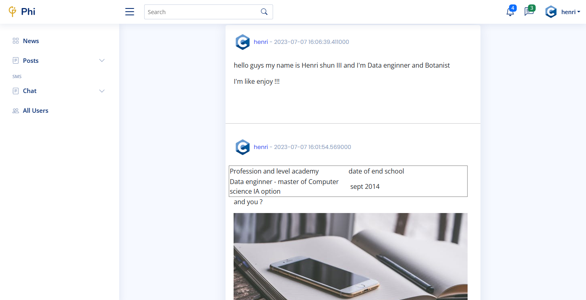 | 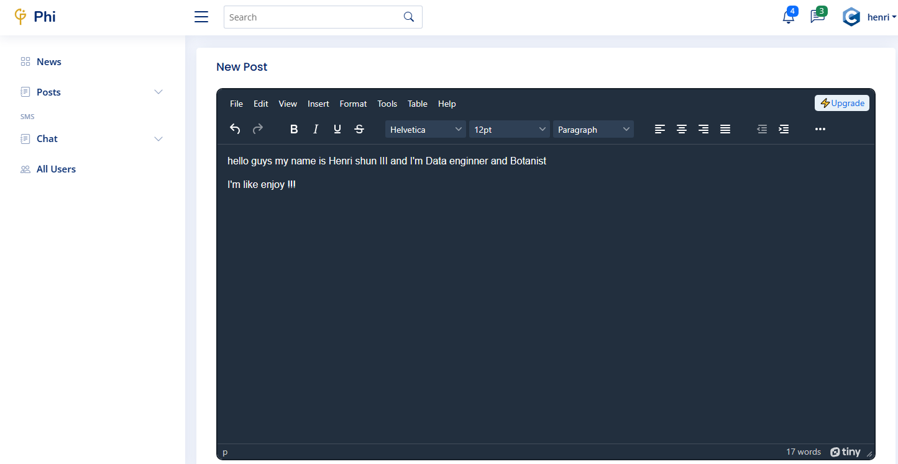 | 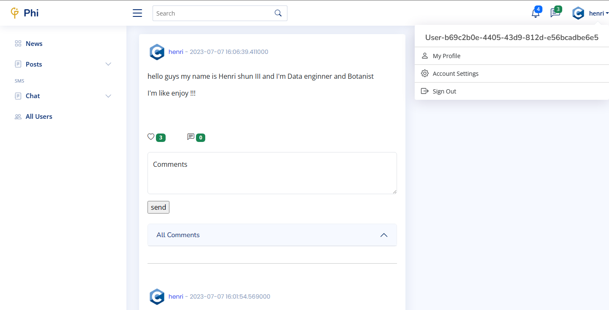 |

<br>

## comments post

| write comment | post comment |
|:-------------:|:------------:|
|  | 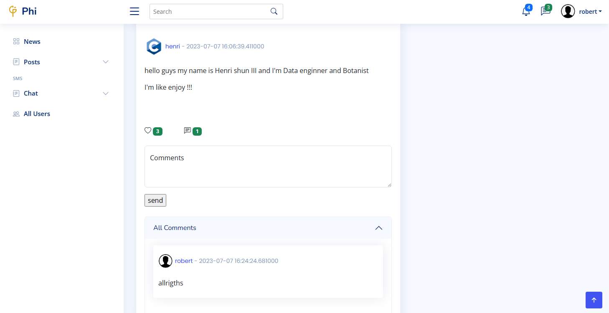 |

## Profil and Profil update

| profil | profil update | finish view |
|:------:|:-------------:|:-----------:|
|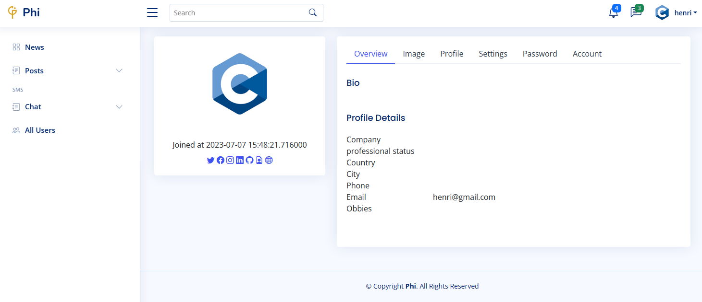 | 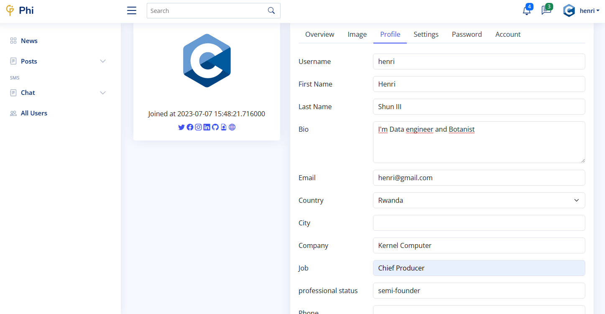 | 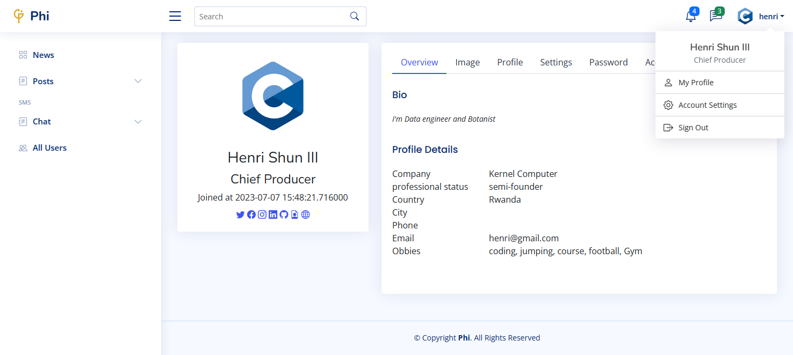 |

<br>

## Settings - View users profil -

| settings | view profil and send friends request | user view friend request|
|:--------:|:------------------------------------:|:-----------------------:|
| 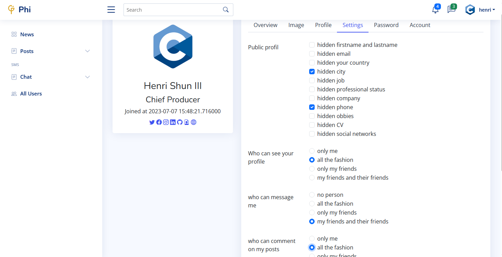 | 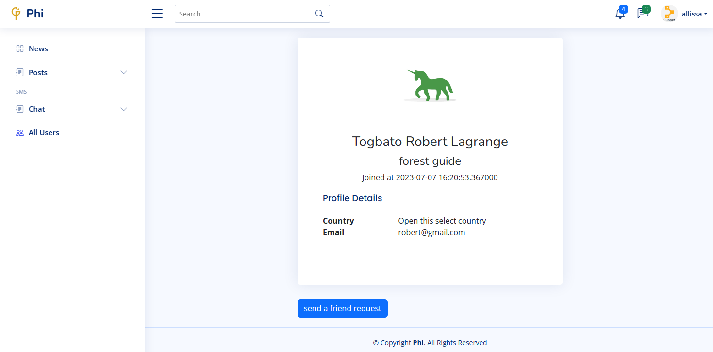 | 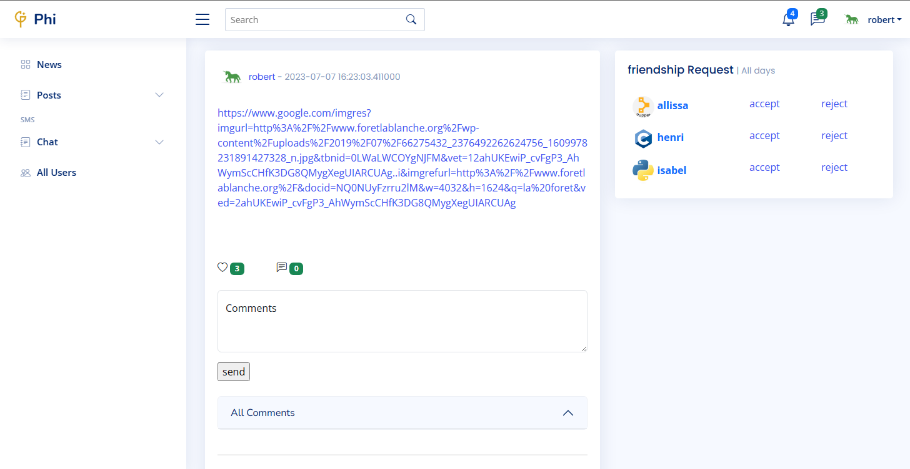 |

## Remove account

| before remove| remove | after remove |
|:------------:|:------------:|:------------:|
| 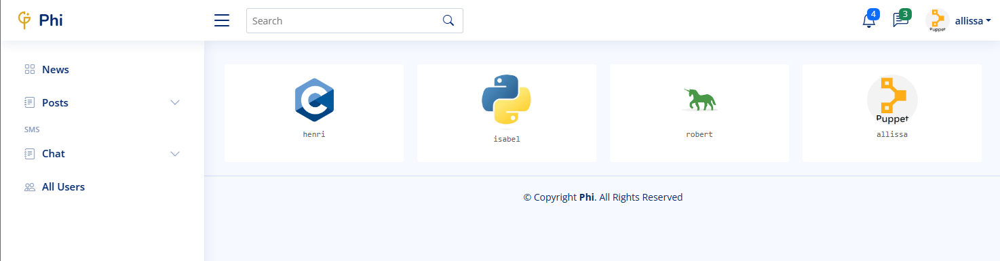 | 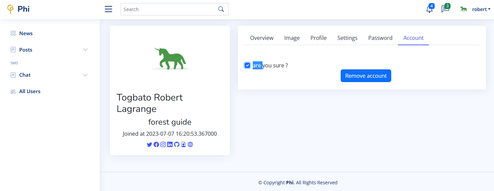 | 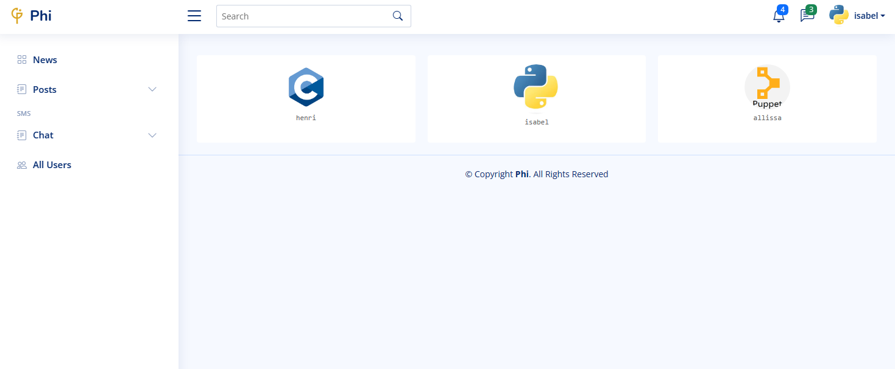 |
